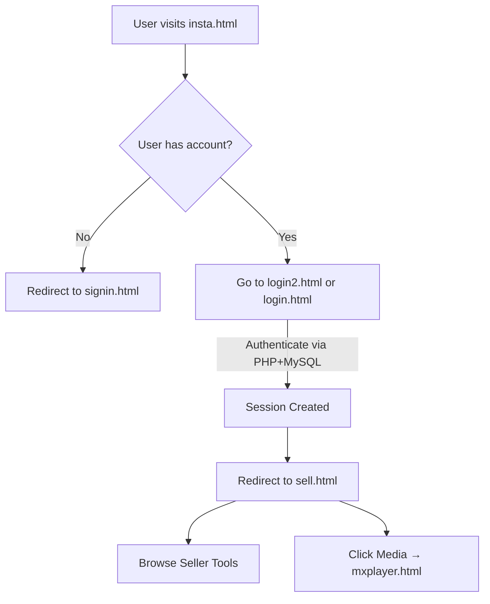

# MR.RoBoT
# AmanZindabaad

# 🛍️ TechBazaar — A Media-Rich E-commerce + Social Web Platform

**TechBazaar** is a dynamic full-stack web application that blends the functionality of an e-commerce platform (like Amazon) with media streaming features (like MX Player) and social interactions (inspired by Instagram). It is designed using HTML, CSS, JavaScript, PHP for server-side logic, and MySQL for persistent storage.

---

## 🌐 Website Overview

This website simulates a modern digital platform where users can:

- **Create accounts and sign in**
- **Log in using multiple interfaces (Amazon/Instagram-like)**
- **Browse and register to become sellers**
- **Stream media content in an MX Player–like experience**
- **Explore social profile interfaces with interaction options**

---

## 🔧 Technology Stack

- **Frontend**: HTML5, CSS3, JavaScript, Font Awesome
- **Backend**: PHP
- **Database**: MySQL
- **Architecture**: Multi-page app using forms and PHP endpoints

---

## 📁 File Structure

```
📦 root
 ┣ 📜 insta.html         # Instagram-style profile interface
 ┣ 📜 signin.html        # Sign-up page with form validation
 ┣ 📜 login2.html        # Instagram-style login
 ┣ 📜 login.html         # Amazon-style login
 ┣ 📜 sell.html          # Seller portal with promotional content
 ┣ 📜 mxplayer.html      # Media interface with sliders and categories
 ┣ 📜 *.css              # Corresponding stylesheets
 ┣ 📜 *.js               # JavaScript for interactivity
 ┣ 📜 *.php              # Backend PHP handlers for login, signup, etc.
 ┗ 📂 database.sql       # MySQL schema and table definitions
```

---

## 🧠 Project Workflow



---

## 📌 Key Features

### 🔐 Authentication
- Users sign up with email, phone, username, and password.
- Data is stored in MySQL via PHP (`signin.php`, `login_1.php`).
- Passwords can be hashed and validated.

### 🛒 Seller Portal (`sell.html`)
- After login, users can navigate to seller tools.
- Promotional banners, price cuts, and selling guides are displayed.

### 🎥 Media Interface (`mxplayer.html`)
- Horizontal sliders showing trending, popular, and genre-based content.
- Simulates video content display similar to MX Player or Prime Video.

### 👤 Social Profile Interface (`insta.html`)
- Styled like an Instagram profile.
- Options to log in or sign in from profile screen.

---

## 🗄️ Database Schema (Simplified)

```sql
CREATE TABLE users (
  id INT AUTO_INCREMENT PRIMARY KEY,
  email VARCHAR(100),
  username VARCHAR(100),
  fullname VARCHAR(100),
  phone VARCHAR(15),
  password VARCHAR(255)
);

CREATE TABLE login_logs (
  id INT AUTO_INCREMENT PRIMARY KEY,
  user_id INT,
  login_time TIMESTAMP DEFAULT CURRENT_TIMESTAMP
);
```

---

## 🚀 How to Run Locally

### Prerequisites
- XAMPP/WAMP/LAMP stack installed
- MySQL enabled
- PHP 7+ support

### Steps

1. Clone or download the repo into your web root (e.g., `htdocs`)
2. Import `database.sql` into phpMyAdmin
3. Start Apache and MySQL
4. Open `http://localhost/your-folder/insta.html` in a browser

---

## 📈 Future Enhancements

- Add email verification & password reset
- Secure session management with tokens
- Media upload support for users
- Admin panel for content moderation

---

## 💬 Summary

**TechBazaar** is an all-in-one prototype demonstrating:

- **Authentication + Role-based Access**
- **Seller interaction workflows**
- **Entertainment UI integration**
- **Modern responsive design patterns**

This project can be used for learning, showcasing full-stack skills, or further developing into a SaaS-style platform.

---
